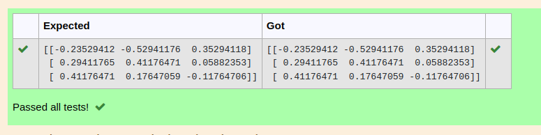

# INVERSE-OF-A-MATRIX
## Aim:
To write a python program to find the inverse of a matrix
## Equipment’s required:
1. 	Hardware – PCs
2. 	Anaconda – Python 3.7 Installation / Moodle-Code Runner
## Algorithm:
### Step1 : 
Import numpy package.
### Step 2: 
Assign the values of the matrix in an array.
### Step 3: 
Using linalg calculate the inverse.
### Step 4: 
Print the output.

## Program:
```Python
#Program to find the inverse of a matrix.
#Developed by: Sam Israel D
#RegisterNumber: 22008392
import numpy as np
A = np.array([[1,0,3],[-1,2,-2],[2,3,-1]])
print (np.linalg.inv(A))
```
## Output:

## Result:
Thus the inverse of given matrix is successfully solved using python program

